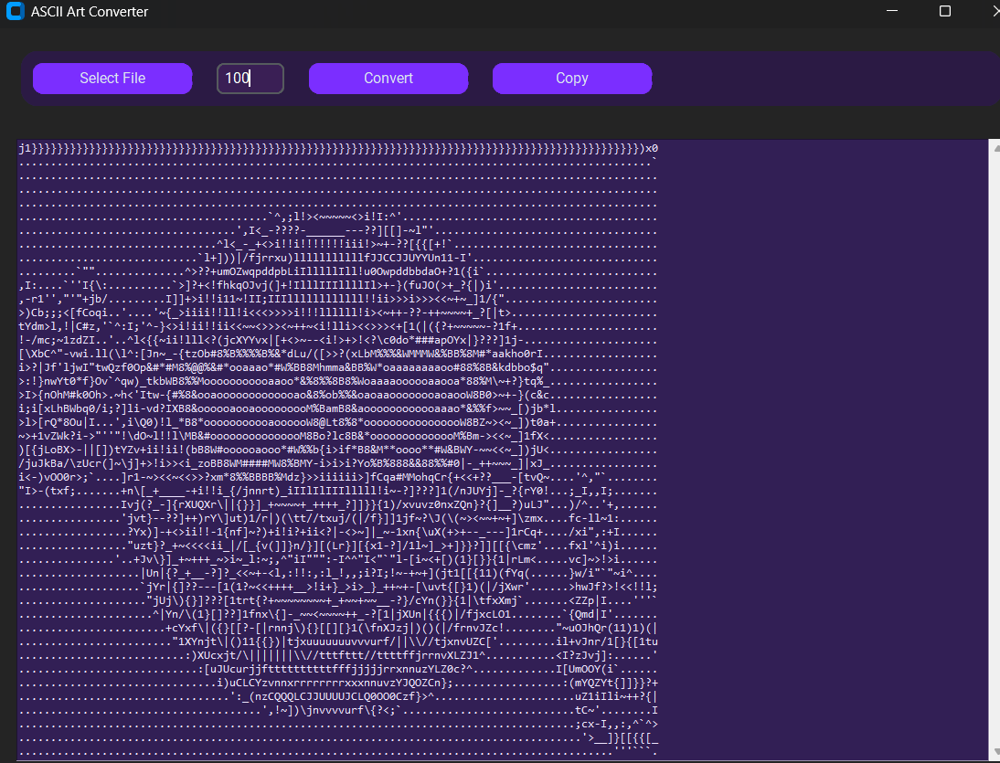

Modern Gradient ASCII Art Converter
Небольшой проект, сделанный по просьбе друга. Берет картинку и конвертирует её в ASCII-арт.
Функционал
Выбор изображения, настройка ширины, конвертация и копирование результата в буфер обмена.




```bash
pip install pillow customtkinter
```


```bash
python main.py
```

Нажми Select File, чтобы выбрать картинку.
Введи нужную ширину для ASCII-арта.
Нажми Convert для генерации.
Нажми Copy, чтобы скопировать результат.
